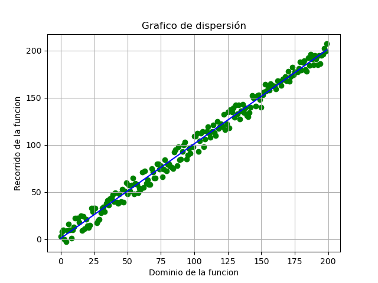

# Regresión lineal de datos

La regresión lineal es un método estadístico que trata de modelar la relación entre una variable continua y una o más variables independientes mediante el ajuste de una ecuación lineal. Se llama regresión lineal simple cuando solo hay una variable independiente y regresión lineal múltiple cuando hay más de una. Dependiendo del contexto, a la variable modelada se le conoce como variable dependiente o variable respuesta, y a las variables independientes como regresores, predictores o features.

https://www.cienciadedatos.net/documentos/py10-regresion-lineal-python.html
https://es.wikipedia.org/wiki/Regresi%C3%B3n_lineal

    # --------------------------------------------
    # -------- REGRESIÓN LINEAL ------------------
    # --------------------------------------------
    # leoparada.com@gmail.com

    # Obtención de datos
    import random

    # Tratamiento de datos
    # ------------------------
    import pandas as pd
    import numpy as np

    # Graficado de datos
    # ------------------------
    import matplotlib.pyplot as plt

    # modelado de datos
    # ------------------------
    from sklearn.linear_model import LinearRegression

    # [1] Creación del conjunto de datos para aplicar la regresion lineal
    # ---------------------------------------------------------------------
    # nums = [1,2,3,4]
    nums = list(range(200))
    A = []
    for n in nums:
        try:
            a   = n
            b   = n+1
            aux = random.randint(a, b)+random.randint(-10, 10)
            A.append(aux) 
        except:
            print('fin')
    # se le agrega un try catch para evitar el desborde al llegar al ultimo par apuntado en el ciclo for

    y_train = A
    x_train = list(range(len(y_train)))

    x_tra   = np.array(x_train).reshape((-1, 1))
    y_tra   = np.array(y_train )

    # [2] Creación del modelo
    # --------------------------------------------------------------------------
    model = LinearRegression()
    model.fit(X = x_tra, y = y_tra)

    # [3] Visualización de Estadisticos
    # --------------------------------------------------------------------------
    print('coefficient of determination:', model.score(x_tra, y_tra))
    print('intercept:', model.intercept_)
    print('slope:', model.coef_)

    # [4] Construcción de la recta
    # --------------------------------------------------------------------------
    xdata = x_train
    m     = model.coef_
    n     = model.intercept_  
    ydata = [_*m+n for _ in xdata]

    # Vi
    # ------------------------------------------

    # graficando la recta
    plt.plot(xdata, ydata, 'b')
    # graficando la data
    plt.scatter(x_train,y_train,color='green')
    # configuración de la vista gráfica
    plt.grid()
    plt.title('Grafico de dispersión');
    plt.xlabel('Dominio de la funcion');
    plt.ylabel('Recorrido de la funcion');

    plt.show(block=False)
    # persistencia de la imagen: guardado en archivo 
    plt.savefig("grafico_dispersion.png")
    plt.pause(10)
    plt.close()

